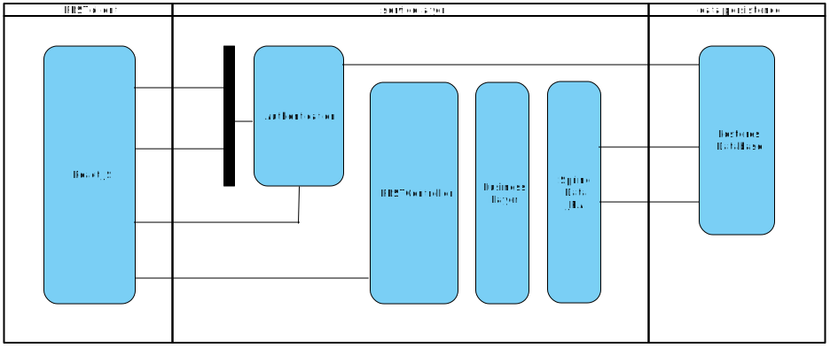

```
 ██████╗ ██████╗ ██╗    ██╗███████╗██████╗     ██████╗ ██╗   ██╗███████╗███████╗     ██████╗ ██╗   ██╗██╗   ██╗███████╗
██╔════╝██╔═══██╗██║    ██║██╔════╝██╔══██╗    ██╔══██╗██║   ██║██╔════╝██╔════╝    ██╔════╝ ██║   ██║╚██╗ ██╔╝██╔════╝
██║     ██║   ██║██║ █╗ ██║█████╗  ██████╔╝    ██████╔╝██║   ██║█████╗  █████╗      ██║  ███╗██║   ██║ ╚████╔╝ ███████╗
██║     ██║   ██║██║███╗██║██╔══╝  ██╔══██╗    ██╔═══╝ ██║   ██║██╔══╝  ██╔══╝      ██║   ██║██║   ██║  ╚██╔╝  ╚════██║
╚██████╗╚██████╔╝╚███╔███╔╝███████╗██║  ██║    ██║     ╚██████╔╝██║     ██║         ╚██████╔╝╚██████╔╝   ██║   ███████║
 ╚═════╝ ╚═════╝  ╚══╝╚══╝ ╚══════╝╚═╝  ╚═╝    ╚═╝      ╚═════╝ ╚═╝     ╚═╝          ╚═════╝  ╚═════╝    ╚═╝   ╚══════╝
```

### - Insert Title Here -




01. [x] [`maven`](#maven) to build the project <br>
02. [x] [`webpack`](#webpack) to bundle the javascript <br>
03. [x] [`thymeleaf`](#thymeleaf) to serve `index.html` <br>
04. [ ] [`react`](#react) to make requests to the api and render the component views <br>
05. [ ] [`flyway`](#flyway) to manage `postgres` db migrations <br>
06. [ ] [`rest repositories`](#rest-repositories) to manage `postgres` db migrations <br>
07. [ ] [`jpa`](#jpa) to manage `postgres` db migrations <br>
08. [ ] [`h2`](#h2) to manage `postgres` db migrations <br>
10. [ ] [`lombok`](#lombok) to manage `postgres` db migrations <br>


Front End :
Backend / Server :
Tool chain :


### maven
### webpack
### thymeleaf
### react
### flyway
### rest repositories
### jpa


### h2

> H2 is a relational database management system written in Java.
```
+ It can be embedded in Java applications or run in the client-server mode.
+ In-memory databases live only during the time of execution of the application.
+ H2 supports a sub set of the SQL standard.
+ H2 also provides a web console to maintain the database.
```

The project will require the following dependency in the pom.xml file :
```
<dependency>
   <groupId>com.h2database</groupId>
   <artifactId>h2</artifactId>
   <scope>runtime</scope>
 </dependency>
```
To enable the H2 console, add the following code to :
`test` / `resources` / `application.properties`

```
spring.h2.console.enabled=true
```
Start the Application ;
```
mvn -pl persistence spring-boot:run
```

Login to the database with the following credentials :
```
http://localhost:8080/h2-console
JDBC URL: jdbc:h2:mem:testdb
User Name: sa
Pasword: <leave this empty>
```

Addendum : The above steps are not necessary if you are using the [Spring Boot DevTools](https://docs.spring.io/spring-boot/docs/current/reference/html/using-boot-devtools.html "Spring Boot DevTools")
```
<dependency>
    <groupId>org.springframework.boot</groupId>
    <artifactId>spring-boot-devtools</artifactId>
    <optional>true</optional>
</dependency>
```
<br>
<br>

### lombok

> Lombok is a java library that plugs into your editor and build tools
> to generate getter and setter methods -- to keep your code cleaner